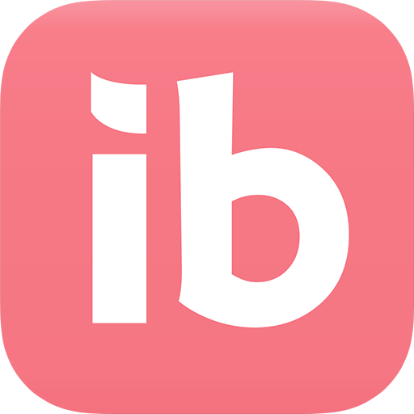
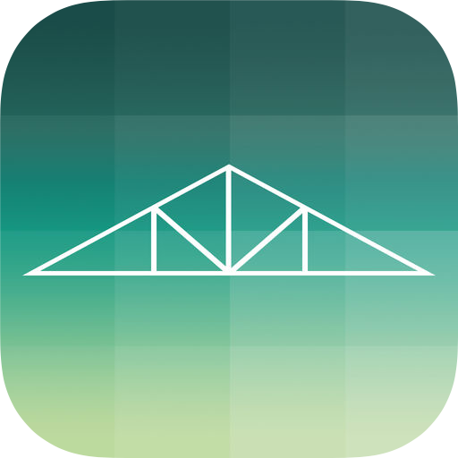
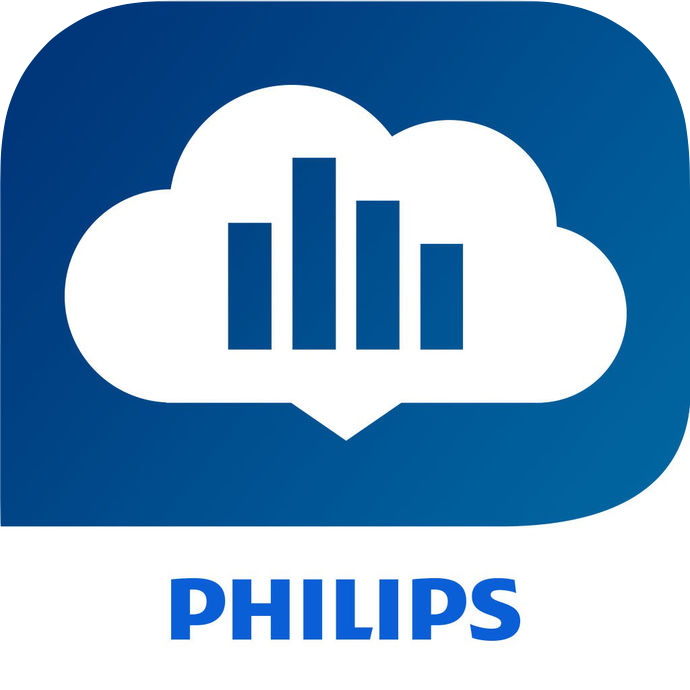
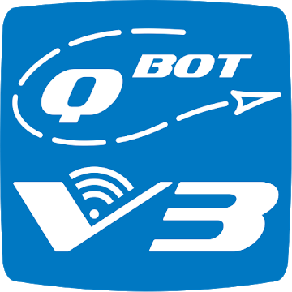
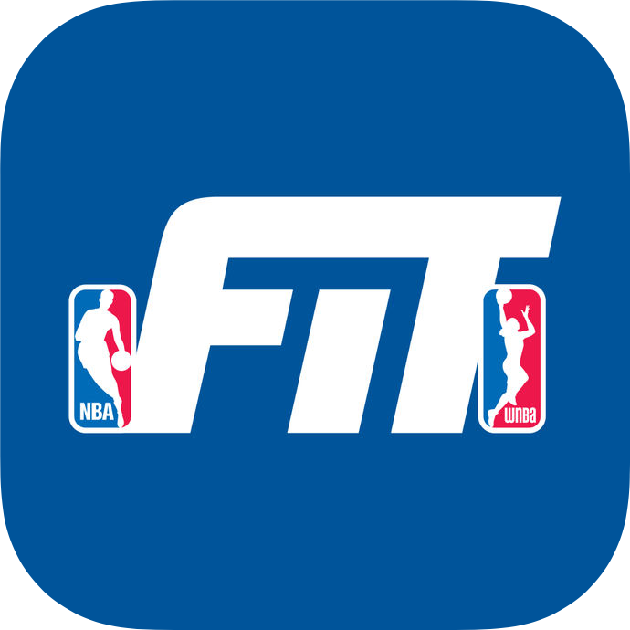
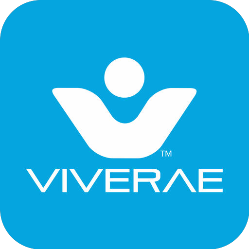
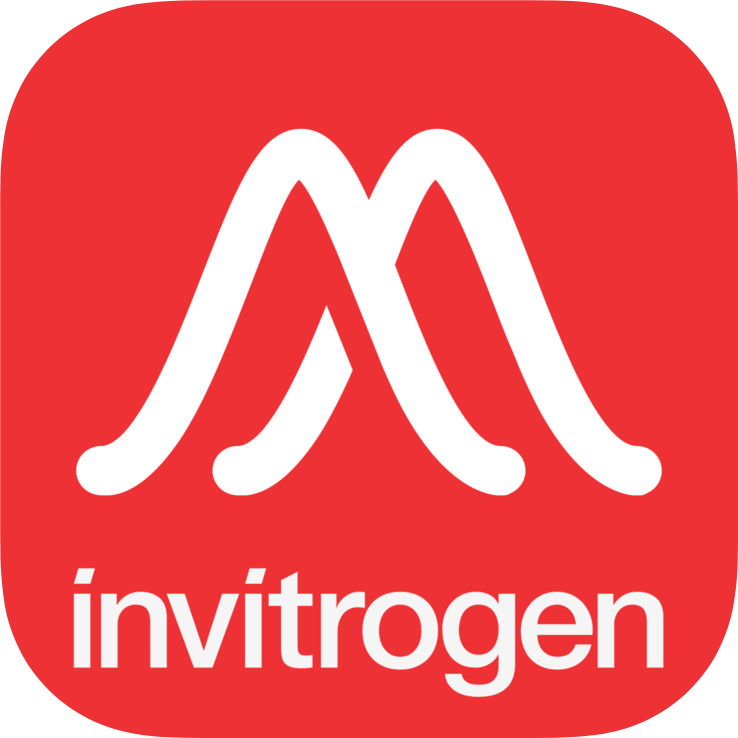
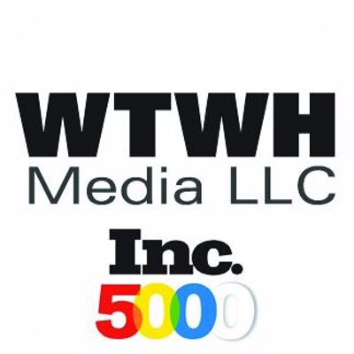
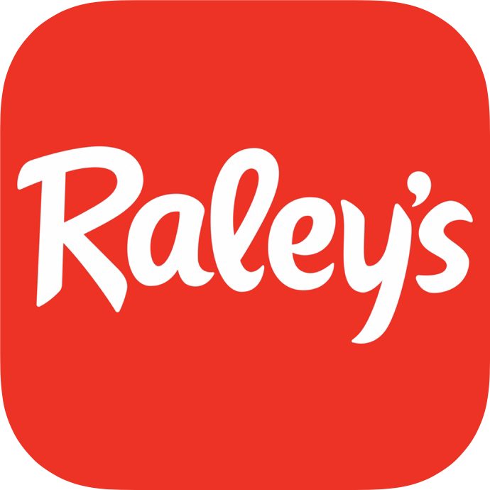

<table align="center">
    <tr>
        <td>
            
        </td>
        <td>
            
        </td>
    </tr>
</table>

Builder and collaborator, crafting delightful iOS user experiences, delivering products to market for 10 years. I focus on user outcomes, usable interfaces, clean code, and working software. I have worked with all kinds of clients, from lone individuals, small and large startups, to Fortune 100 companies, and my work has been included in acquisitions by Google, Amazon, and Microsoft.

<table align="center">
    <tr>
        <td>
            
        </td>
        <td>
            
        </td>
        <td>
            
        </td>
        <td>
            
        </td>
        <td>
            
        </td>
        <td>
            
        </td>
        <td>
            
        </td>
    </tr>
    <tr>
        <td>
            
        </td>
        <td>
            
        </td>
        <td>
            
        </td>
        <td>
            
        </td>
        <td>
            
        </td>
        <td>
            
        </td>
        <td>
            
        </td>
    </tr>
</table>

 
 

# Projects

### [Major Input](https://github.com/rlwimi/major-input)

This iPad app presents a novel UI concept for swiftly reading WWDC session transcripts without losing the video/presentation context. It's a text scrubber for video, turning the passive experience of watching a video into an active, engaging reading experience, while saving a little time.

 
 

### [Ibotta](https://ibotta.com)

An iPhone app for the Ibotta platform, providing cash back rewards for consumer purchases since 2012. Launched a campaign to correct the course of a legacy, mixed Swift/Objective-C codebase with 2% test coverage that was proving problematic for team velocity, stability of releases, and maintainability. Introduced an MVVM-C architecture for greenfield work, with some additional concepts from VIPER, RIBs, React, and Redux, supporting integration with legacy work and progressive migration. Enabled rapid iteration and sustainable support of new features in an IB-free environment with: composable, Auto Layout-based UI components and assembly infrastructure supporting a highly dynamic UI driven by backend data, unit testing of view models, snapshot testing of UI components and screens, and Playground-driven UI development. Maintained codebase integrity while executing migrations to new releases of Swift, iOS, dependencies, and CI tooling. Enabled testability across the codebase. Built and executed our release process weekly. Modified team workflows and built feature flag infrastructure to support the organization’s highly dynamic and decentralized approach to feature development. Extensively mentored a team growing from 4 to 10, advocating and teaching good software engineering principles. Wrote a team style guide with some enforcement automated by SwiftLint.

[App Store](https://itunes.apple.com/us/app/ibotta-cash-back-rewards-app/id559887125?mt=8) • [video tour](https://www.youtube.com/watch?v=WNDuKHVjkg0) • [Westword](https://www.westword.com/restaurants/brian-leach-created-ibotta-the-most-downloaded-app-to-come-out-of-colorado-11255616) • [Forbes](https://www.forbes.com/sites/amitchowdhry/2018/01/29/how-ibotta-is-helping-every-day-consumers-save-time-and-money/#74ac13033179)

 
 

### [eero](https://eero.com)

Led Mutual Mobile's iOS contingent in a blended Mutual Mobile/eero mobile team to deliver eero's app for easy WiFi network setup and management in conjunction with the launch of their home mesh WiFi system. eero was recently [acquired](https://www.theverge.com/2019/2/11/18220960/amazon-eero-acquisition-announced) by Amazon.

[App Store](https://itunes.apple.com/us/app/eero-home-wifi-system/id1023499075?mt=8) • [video tour](https://www.youtube.com/watch?v=w2LX4QXNVA0) • [CNet](https://www.cnet.com/products/eero-wi-fi-system/) • [Engadget](https://www.engadget.com/2016/02/23/eero-is-the-home-wifi-solution-ive-been-waiting-for/) • [Brian Krebs](https://krebsonsecurity.com/2016/03/eero-a-mesh-wifi-router-built-for-security/) • [Gizmodo](http://gizmodo.com/a-stupid-simple-router-for-super-lazy-people-1764670728) • [Consumer Reports](http://www.consumerreports.org/wireless-routers/the-eero-router-solved-my-wifi-problems/)

 
 

### [Beam](https://mutualmobile.com/work/beam-for-ios)

After developing some HomeKit expertise, and before Apple released its HomeKit app including Control Center integration with iOS 10, we saw a large gap in the market for a beautiful, functional, universal HomeKit app, so we built Beam. Beam almost certainly influenced Apple's approach to designing their iOS Home app. Beam has been discontinued.

[video tour](https://mutualmobile.wistia.com/medias/suisyn0art) • [video review](https://www.youtube.com/watch?v=IX9-eLAfxTI) • [case study](https://mutualmobile.com/posts/beam-solving-the-smart-home-puzzle-through-collaboration-and-innovation) • [ad spot](https://mutualmobile.wistia.com/medias/t8ka03jn0s)

 
 

### [Honeywell](https://www.honeywell.com)

Honeywell's universal iPhone/iPad app for their [Lyric connected thermostat](https://www.honeywellhome.com/en/products/thermostat/lyric-thermostat), along with foundational Bluetooth and HomeKit infrastructure for connecting with other Honeywell connected home devices. Inherited a beta codebase, built out dynamic geofencing support, built new flows and improved existing flows around device connectivity and installation. See my custom geofencing map UI work in this video user guide at [0:54](https://youtu.be/UUkJnCvdfMk?t=54) and again at [2:37](https://youtu.be/UUkJnCvdfMk?t=157). At the bottom right of the map, note the custom scale indicator updating as the map zooms. Lyric is now [Honeywell Home](https://www.honeywellhome.com/homeapp) by [Resideo](https://www.resideo.com), with a new look and feel.

 [App Store](https://itunes.apple.com/us/app/honeywell-lyric/id880332077?mt=8) • [video tour](https://www.youtube.com/watch?v=6wLjmGfIPLw) • [older landing page](https://www.honeywellhome.com/statichtml/lyric-app.html) • [The Verge](https://www.theverge.com/2014/6/10/5793536/the-heat-is-on-honeywell-is-finally-ready-to-challenge-nest)

 
 

### [Lynda.com](https://www.lynda.com)

Launched Lynda.com's universal iPhone/iPad app, providing millions of users with a convenient new way to access the video learning platform for design, programming, and more. Worked with [HLS](https://developer.apple.com/streaming/) for adaptive bitrates, multiple language captioning, and a custom content encryption system to support offline mode before Apple provided integrated Fairplay DRM support. Created a custom video player using AVFoundation framework prior to AVKit's introduction. In 2015, Lynda.com was [acquired](https://www.lynda.com/press/pressrelease?id=4563) by [LinkedIn](https://news.linkedin.com/2015/linkedin-to-acquire-lyndacom) ([more coverage](https://www.recode.net/2015/4/9/11561324/three-reasons-linkedin-broke-the-bank-for-lynda-com)), which was itself [acquired by Microsoft](https://news.microsoft.com/2016/06/13/microsoft-to-acquire-linkedin/) in 2016.

[App Store](https://itunes.apple.com/us/app/lynda.com-online-training/id356169777?mt=8) • [landing page](https://www.lynda.com/apps/ios)

 
 

### [Philips Respironics](https://www.sleepapnea.com)

Laid the foundation for the DreamMapper iPhone app, which communicates with a user's CPAP machine via proprietary protocols built on top of Apple's MFi/ExternalAccessory framework, to help coach them in proper use of the machine and collect and report usage statistics for regulatory and insurance accountability.

[App Store](https://itunes.apple.com/us/app/dreammapper/id530569351?mt=8) • [landing page](https://www.sleepapnea.com/products/dreammapper/)

<a id="qbot">
 
 
</a>

### [Qbot](http://www.myqbot.com)

A prototype iPad app providing a modern user interface and control system for the QBot robotic quilting controller. An [Android version](https://play.google.com/store/apps/details?id=com.myqbot.qbot1) was eventually released.

 
 

### [NBA Fit](http://fit.nba.com)

An NBA social fitness experience iPhone app, powered by UnderArmour's platform, designed to teach, motivate, and challenge basketball fans to be active and healthy.

[App Store](https://itunes.apple.com/us/app/nba-fit/id1114090140?mt=8) • [landing page](http://fit.nba.com/app/) • [Engadget](https://www.engadget.com/2016/06/01/nba-has-its-own-fitness-app-with-training-tips-from-the-pros/) • [Mashable](http://mashable.com/2016/06/01/nba-fitness-app/#_j_3v2ZX0PqL)

 
 

### [Softcard](https://en.wikipedia.org/wiki/Softcard)

An iPhone and Android app, later [acquired and discontinued by Google](http://www.theverge.com/2015/3/5/8152801/softcard-shutting-down-march-31), culminating the digital wallet collaboration of mobile carriers AT&T, T-Mobile, and Verizon, originally known as [Isis](https://techcrunch.com/2014/09/03/isis-mobile-wallet-rebrands-to-softcard-to-distance-from-miltant-terror-group/). Working with an external hardware case that provided a secure element, launched the iPhone app nationwide, then joined the Android development team.

[Consumer Reports](http://www.consumerreports.org/cro/news/2014/09/virtual-wallet-review-apple-pay-google-wallet-softcard-and-loop-wallet/index.htm) • [CreditCards.com](https://www.youtube.com/watch?v=9k3ko58oPx0)

 
 

### [Viverae](http://viverae.com)

Viverae's iPhone app helps employees of member companies easily interface with the health/wellness-gamifying platform for group healthcare savings. Built the foundation for initial launch. Shortly after rebranding as [SimplyWell](https://simplywell.com), Viverae was recently [acquired](https://www.virginpulse.com/press/virgin-pulse-acquires-leading-workplace-wellness-company-viverae-simplywell/) by Virgin to be absorbed into [Virgin Pulse](https://www.virginpulse.com).

[App Store](https://itunes.apple.com/us/app/viverae/id1147669858?mt=8)

 
 

### [ThermoFisher Scientific](https://www.thermofisher.com/us/en/home.html)

An iPhone app, [Invitrogen](https://en.wikipedia.org/wiki/Invitrogen) Molecular Probes Flourescense SpectraViewer presents and graphs the technical specs of fluorescent proteins and dyes used in biotech applications. Creates PDFs for sharing.

[App Store](https://itunes.apple.com/us/app/fluorescence-spectraviewer/id421031826?mt=8) • [landing page](https://www.thermofisher.com/us/en/home/life-science/lab-data-management-analysis-software/lab-apps/fluorescence-spectraviewer-app.html)

 
 

### [WTWH Media](http://www.wtwhmedia.com)

A universal iPhone/iPad app, custom RSS reader for the WTWH family of trade magazines including [Design World](http://www.designworldonline.com). The app is discontinued.

[WTWH announcement](https://marketing.wtwhmedia.com/design-world-ipad-app/) • [Folio interview](https://www.foliomag.com/what-consider-when-greelighting-app/)

 
 

### [Raley's](http://www.raleys.com/www/)

An Epicurious iPhone app clone visualizes a recipe database, now discontinued.

 
 

### [PeopleFinders](http://www.peoplefinders.com)

Pair of iPhone apps, Are They Really Single? and Stud or Dud, provides a search interface into PeopleFinders' public records database. Both apps have been discontinued. Creeped out? I encourage you to [opt out](https://www.peoplefinders.com/manage) from this service [and many others](https://www.propublica.org/article/privacy-tools-opting-out-from-data-brokers).

[New York Times](https://gadgetwise.blogs.nytimes.com/2010/02/12/a-pocket-detective-for-daters/?_r=0) • [CNN](http://www.cnn.com/2009/TECH/11/25/dating.apps/) •[Gizmodo](http://gizmodo.com/5408878/these-two-iphone-apps-made-me--realize-that-my-love-life-sucks) • [Are They Really Single? video tour](https://www.youtube.com/watch?v=kEJ9-BIl_2o) • [Stud or Dud landing page](https://www.studordud.com)